# KS4038(KS4039) Keyestudio Robot Arm Microbit Learning Kit

## 1.Description

Micro:bit is a microcontroller of ARM structure designed by the BBC. To be specific, it is only half size of a credit card, onboard with a Bluetooth, an accelerometer, an electronic compass, three buttons, a 5 x 5 LED dot matrix as well as a microphone and is mainly used for programming education of teenagers.
To make Micro:bit more accessible to learn, our team specially developed this robot arm Micro:bit learning kit. It is a STEM education robot arm dedicated to DIY production, programming learning, parent-child entertainment as well as educational training. For instance, we are able to leverage the Micro:bit mainboard and two joystick modules to control the rotation angles of four servos as a way to realize the robot arm to pick up or drop objects in different positions.
For your convenience, tutorials of MakeCode graphical programming and MicroPython language programming are contained in this kit, each of which boasts Micro:bit basic projects and Micro:bit robot arm projects, making it easy for enthusiasts of different ages to master.

## 2. Kit

KS4038 contains Micro:bit mainboard, but KS4039 doesn't contain it.

| #    | Components                             | QTY  | Picture                                                      |
| ---- | -------------------------------------- | ---- | ------------------------------------------------------------ |
| 1    | Micro:bit Mainboard+Official Color Box | 1    |                                      |
| 2    | Micro:bit 16-channel Servo Shield      | 1    | 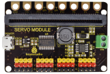                                     |
| 3    | Acrylic Board                          | 1    |  |
| 4    | Acrylic Handle                         | 1    |                                      |
| 5    | MeArm ABS Cylindrical Holder           | 1    |                                      |
| 6    | 180° Servo                             | 3    |  |
| 7    | 180° Servo (Metal Gear)                | 1    | 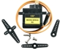                                     |
| 8    | Keyestudio Joystick Module             | 2    |  |
| 9    | 3D PS2 Joystick Cap                    | 2    | 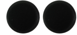 |
| 10   | Cross Screwdriver                      | 1    |                                      |
| 11   | Wrench                                 | 1    |                                      |
| 12   | M3*6MM Round Head Screws               | 12   | 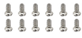                                     |
| 13   | M3*10MM Round Head Screws              | 22   | 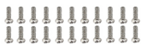                                    |
| 14   | M3*14MM Flat Head Screws               | 2    | 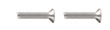 |
| 15   | M3*12MM Round Head Screws              | 12   | 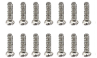 |
| 16   | M3*24+6MM Copper Pillar                | 4    |                                     |
| 17   | M3*6MM+6MM Copper Pillar               | 10   | 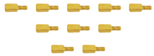 |
| 18   | M3 Hex Nuts                            | 22   | 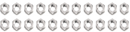                                    |
| 19   | M3 Hexagon Self-locking Nuts           | 24   | 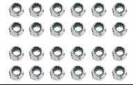 |
| 20   | M2x5MM Phillips Self-tapping Screws    | 10   |  |
| 21   | M3 304 Gasket                          | 10   |  |
| 22   | M2x8MM Phillips Self-tapping Screws    | 2    |                                     |
| 23   | M3*16MM Flat Head Screws               | 2    |  |
| 24   | 200MM M-F DuPont Wire                  | 4    |                                     |
| 25   | Alligator Clip to DuPont Wire          | 8    |                                     |
| 26   | 3*100MM Tie                            | 7    | 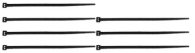 |
| 27   | 6AA Battery Holder                     | 1    | 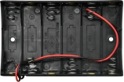                                    |
| 28   | USB Cable                              | 1    | 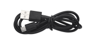                                    |
| 29   | Slotted Screwdriver                    | 1    |                                     |

## 3. Features

1. Detailed installation methods  
2. Detailed debugging method of Micro:bit  
3. Strong expansibility: Boast Micro:bit servo shield and pins, and other sensors and modules can be extended.  
4. Multiple controls : Joystick control and mobile phone APP BT control (Apple and Android phones/Tablets)
5. Learning basic programming: MakeCode graphical programming and MicroPython language programming

## 4. Parameters
Working voltage: DC 5V
Power supply: Micro USB interface: DC 5V
Green terminal post: DC 4.5V-28V
Maximum output current: 1.5A
Maximum power consumption: 32W
Bluetooth remote distance: About 30- 50m (measured) (It is best to use it in an open area with no distracting devices around)

## 5.Keyestudio Micro：bit 16-channel Servo Shield

### 5.1. Introduction

We always fail to drive several motors by Micro:bit control board in DIY experiment. To tell the truth, the output voltage of Micro:bit control board is DC 3.3V while servo should be driven by DC 5V. Also, the drive current of this board is low, and the controlled IO ports are limit when driving multiple servos. 
With this in mind, we specially design this Keyestudio Micro:bit 16-channel servo shield. It mainly adopts a PCA9685PW chip, which enables to communicate with Micro:bit control board for I2C. This shield includes 16 IO ports, making it convenient to connect servos and control 16 servos angle. We expand each control terminal to G, V (5V) and S and use 3pin headers with a spacing of 2.54mm as interfaces. 
When it comes to power supply, we can use Micro USB interface to input DC 5V voltage, or use two green wiring terminals to input DC 4.5V-28V voltage.
More importantly, it adopts a golden finger interface to bring out some control terminals on the Micro:bit control board and 3.3V voltage output terminals, which is convenient for you to connect sensors and modules to the Micro:bit.

***\*Note: The normal no-load current of servo is about 220mA, and the maximum affordable current of Micro USB is 2A. So if you power this board via Micro USB, the board is unable to drive 16 servos simultaneously.\**** 

### 5.2. Parameter

I2C input, control 16-channel PWM output, capable to control 16-channel servos.
Control chip: PCA9685PW
Power supply: Micro USB Port: DC 5V; Green Terminals: DC 4.5V-28V
Frequency: 40-1000Hz
Dimension:  63-43-12mm
Weight: 18.6g

### 5.3. Schematic Diagram

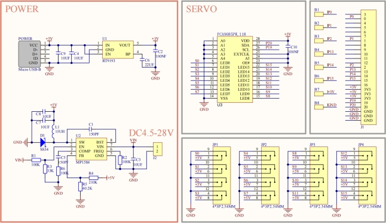
