# Installation Steps

## Essential Pre-Installation Reading:

1. Servos within this product require specific angle adjustments during installation. Please calibrate each servo to its designated angle as per the tutorial before fitting. Adjustment codes are provided at corresponding locations within the guide. Failure to calibrate may result in servo damage.
2. This product features multiple joint positions. Do not overtighten screws at any joint. Strictly follow the tutorial to distinguish between similar screws and their designated positions. Failure to do so may cause the product to malfunction and result in servo burnout.
3. During initial operation, monitor servo temperatures closely. Should temperatures become excessively high, immediately disconnect power without delay. Inspect the product's wiring and check whether any servos are jammed.

## Part 1: Base

**Components Needed**

**Installation Diagram**

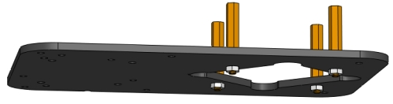

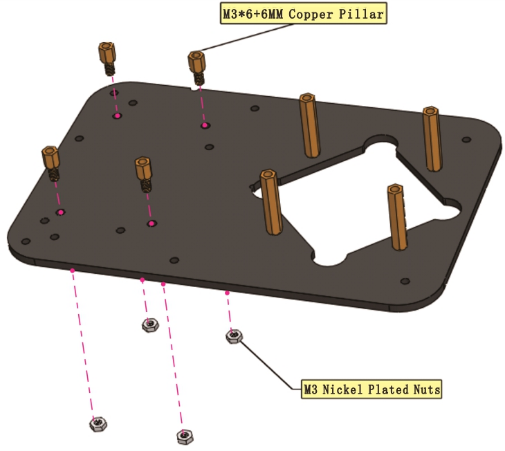

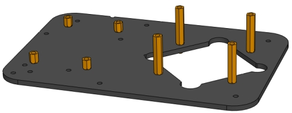

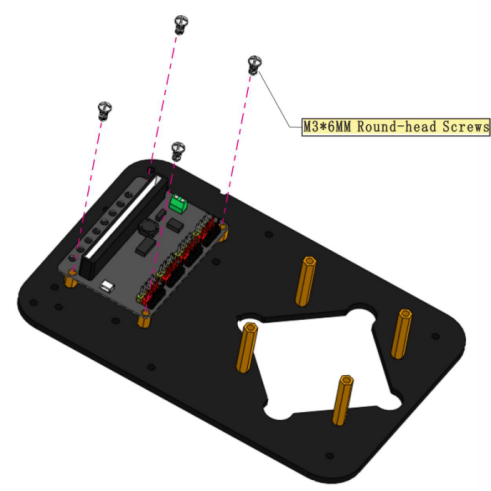

**Prototype**

## Part 2: Bottom Servo

Components Needed

**Installation Diagram**

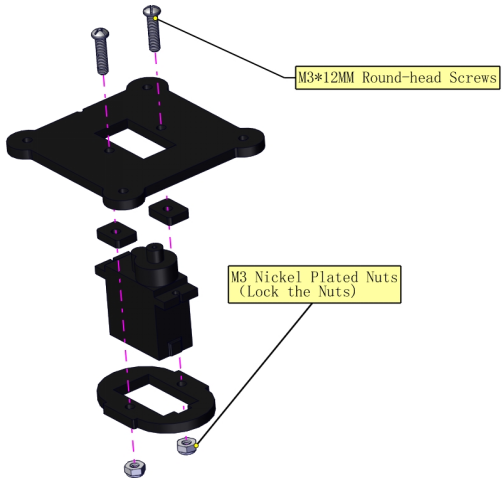

**Prototype**

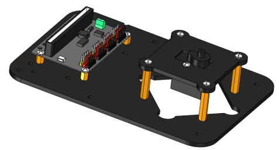

## Part 3: Left (Left Board + Left Servo)

**Components Needed**

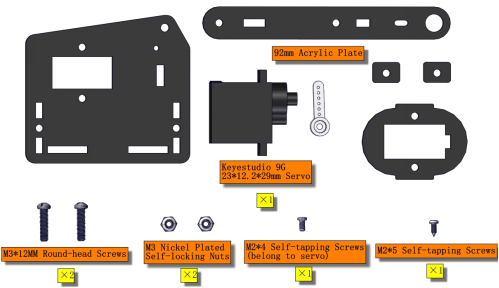

**Installation Prototype**

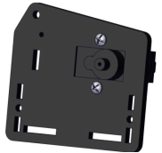

***Initialization of Servo Motor 4 (Left Servo Motor):***

(For a quick installation here, we shall proceed directly with the Makecode code for servo calibration.)

1. Connect the wires as shown in the diagram below, and connect the micro:bit main board to the computer.Once the connection is complete, you will notice a new drive letter named MICROBIT appearing under “This PC”.

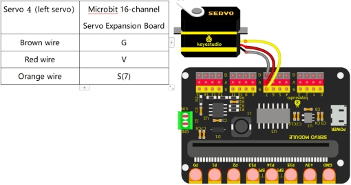

2.[Click here to download the calibration code for Servo Motor 4 (Left Servo)](./Code/Servo_4.7z)

3.Drag the downloaded code into the MICROBIT drive letter.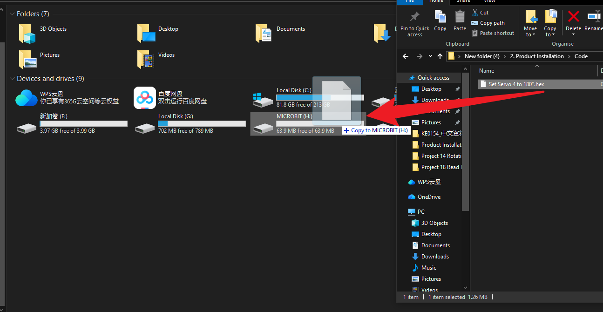

4.Upon completion of the code upload, you should hear the servo motor rotate once before stopping, confirming that the servo has been calibrated. (If no rotation is observed, this indicates the servo is already positioned at the specified angle. Do not alter the servo's angle until its installation is complete.)

**Install the swing arm**

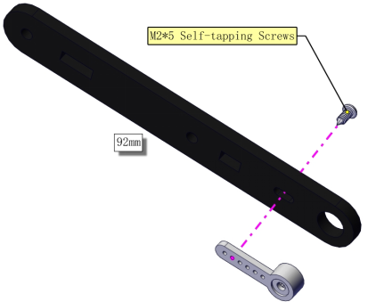

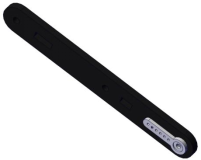

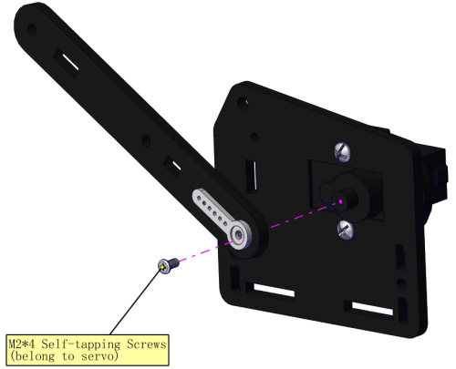

***Prototype***

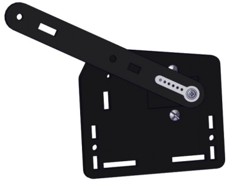

## Part 4: Right (Right Board + Right Servo)

***Components Needed***

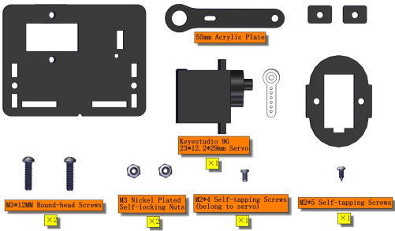

**Installation Diagram**

Pay attention to the gap on the acrylic board

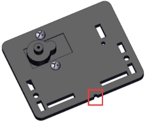

***Servo 1 (Right Servo) Initialization:***

(For a quick installation here, we shall proceed directly with the Makecode code for servo calibration.)

1. Connect the wires as shown in the diagram below, and connect the micro:bit main board to the computer.Once the connection is complete, you will notice a new drive letter named MICROBIT appearing under “This PC”.

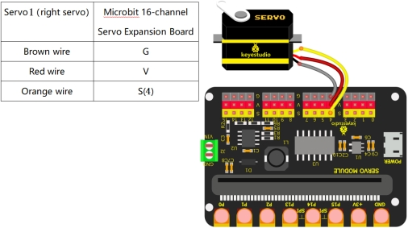

2.[Click here to download the calibration code for Servo Motor 1 (Right Servo)](./Code/Servo_1.7z)

3.Drag the downloaded code into the MICROBIT drive letter.

4.Upon completion of the code upload, you should hear the servo motor rotate once before stopping, confirming that the servo has been calibrated. (If no rotation is observed, this indicates the servo is already positioned at the specified angle. Do not alter the servo's angle until its installation is complete.)

**Install the swing arm:**

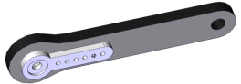

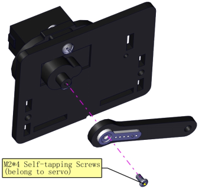

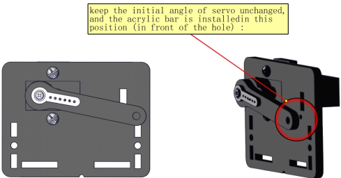

**Prototype**

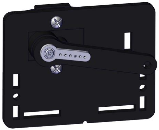

## Part 5: Bracket

**Components Needed**

**Installation Diagram**

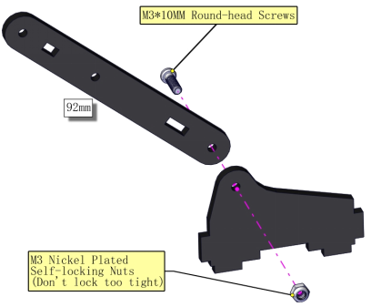

**Prototype**

## Part 6: Left Parts + Bracket

**Components Needed**

**Installation Diagram**

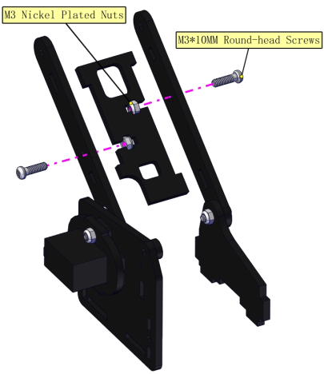

**Prototype**

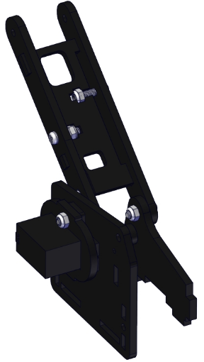

## Part 7: Step 6 + Step 4 + Cylindrical Supporter

**Components Needed**

**Installation Diagram**

**Pay attention to the direction of the supporter**

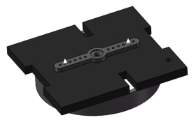

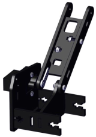

**Prototype**

## Part 8: Middle

**Components Needed**

**Installation Diagram**

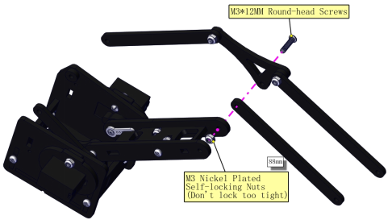

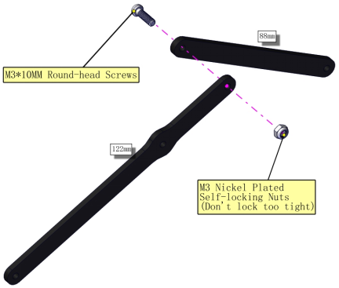

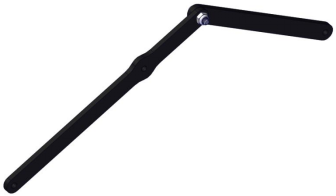

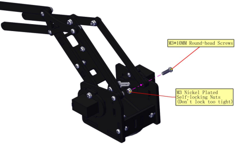

**Prototype**

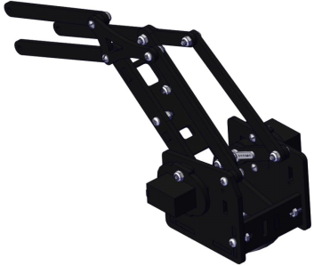

## Part 9: Claw Servo

**Components Needed**

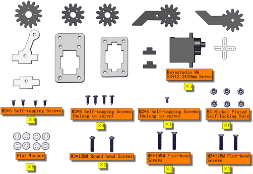

**Installation Diagram**

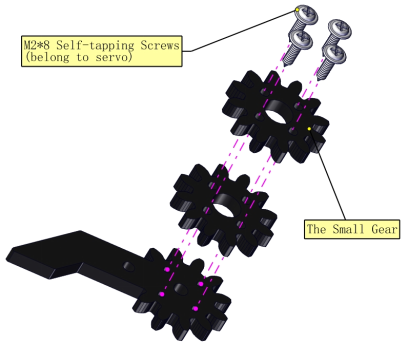

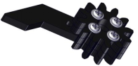

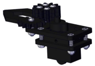

***Servo 3 (Claw Servo) Initialization:***

(For a quick installation here, we shall proceed directly with the Makecode code for servo calibration.)

1. Connect the wires as shown in the diagram below, and connect the micro:bit main board to the computer.Once the connection is complete, you will notice a new drive letter named MICROBIT appearing under “This PC”.

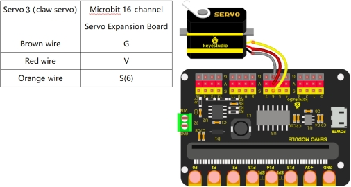

2.[Click here to download the calibration code for Servo Motor  3(Claw Servo)](./Code/Servo_3.7z)

3.Drag the downloaded code into the MICROBIT drive letter.

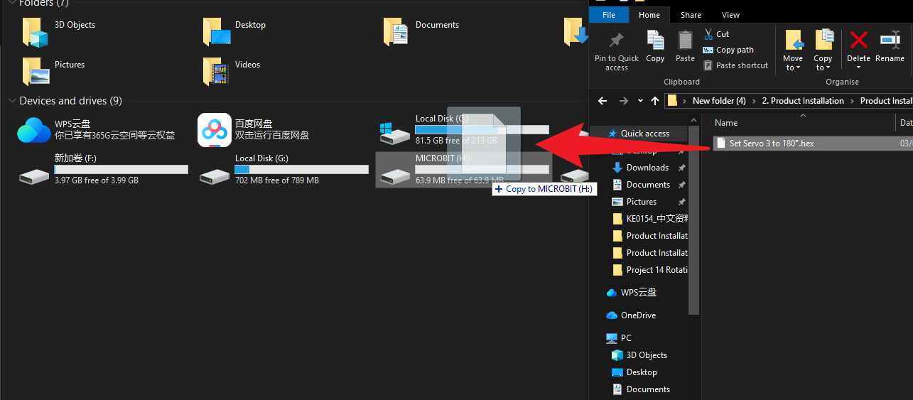

4.Upon completion of the code upload, you should hear the servo motor rotate once before stopping, confirming that the servo has been calibrated. (If no rotation is observed, this indicates the servo is already positioned at the specified angle. Do not alter the servo's angle until its installation is complete.)

**Install Gears:**

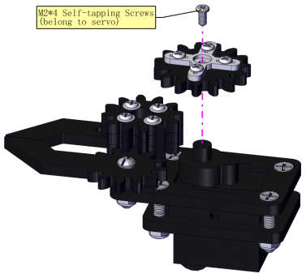

**Prototype**

**Components Needed**

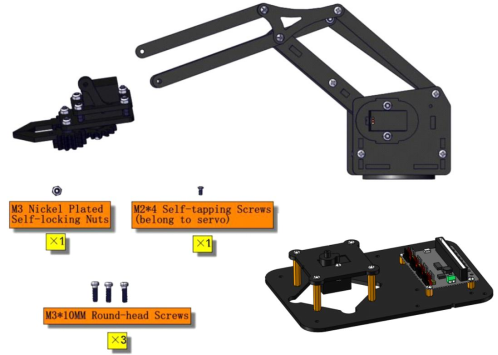

**Installation Diagram**

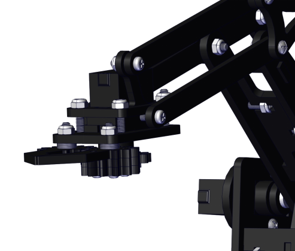

***Servo 2 (Bottom Servo) Initialization:***

(For a quick installation here, we shall proceed directly with the Makecode code for servo calibration.)

1. Connect the wires as shown in the diagram below, and connect the micro:bit main board to the computer.Once the connection is complete, you will notice a new drive letter named MICROBIT appearing under “This PC”.

2.[Click here to download the calibration code for Servo Motor  2(Bottom Servo)](./Code/Servo_2.7z)

3.Drag the downloaded code into the MICROBIT drive letter.

4.Upon completion of the code upload, you should hear the servo motor rotate once before stopping, confirming that the servo has been calibrated. (If no rotation is observed, this indicates the servo is already positioned at the specified angle. Do not alter the servo's angle until its installation is complete.)

**Install the Robot Arm:**

**Prototype**

## Part 11: Robot Arm Control

**Components Needed**

**Installation Diagram**

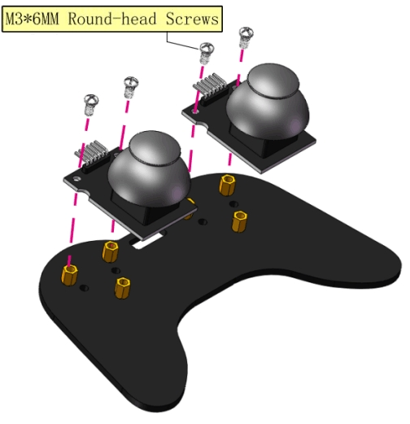

**Prototype**

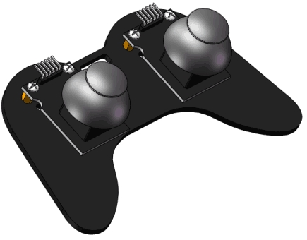

## Wiring and Micro:bit Mainboard Installation

***Servo 1(Right Servo)***

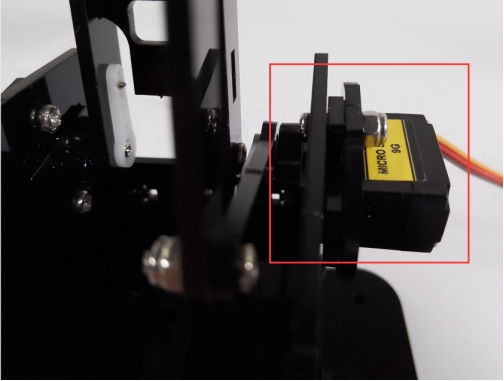

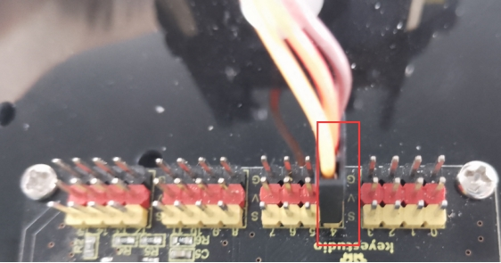

***Servo 2(Base Servo)***

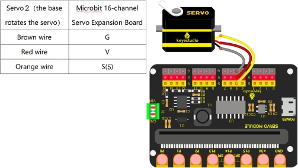

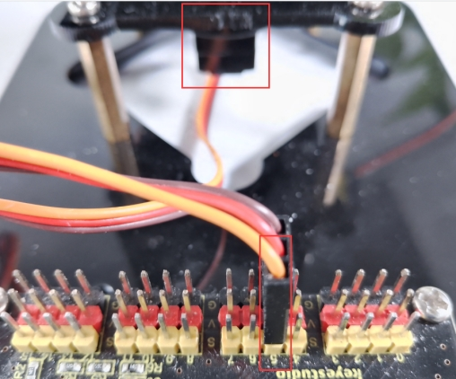

***Servo 3(Claw Servo)***

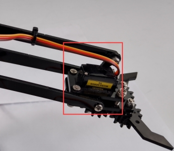

***Servo 4(Left Servo)***

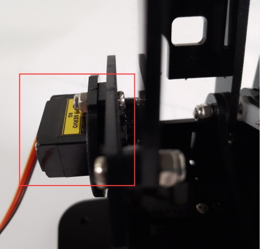

***Plug in micro:bit mainboard***

***Left and Right Joystick Module***

## Complete Robot Arm

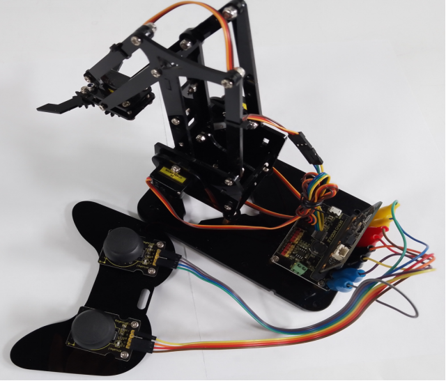

 ***Connect to the external power supply***

Connect the red wire of the battery holder to VIN and the black one to GND via a slotted screwdriver.

The end of the battery holder with the spring is negative pole (-), and the other is positive pole (+).(AA batteries are not provided)