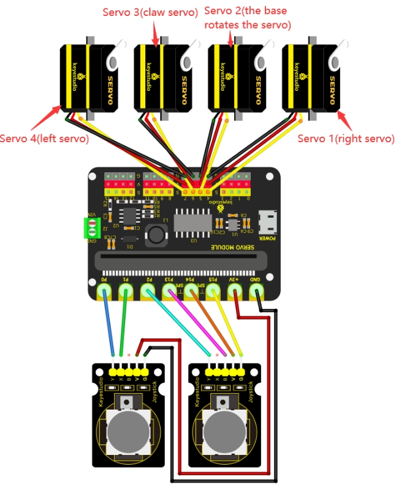

# Project 17: Joysticks Control Robot Arm

------

## 1.Description

In this project, we will combine the previous projects to control the robot arm to achieve multiple movements via two joysticks.

When controlling, set the initial posture as shown below:

### Initial Servo Angles

- **Servo 4 (Left)**: 130°
- **Servo 1 (Right)**: 60°
- **Servo 2 (Base rotation)**: 90°
- **Servo 3 (Claw)**: 60°

------

## 2.Joysticks Control Logic

### Left Joystick

| Condition | Servo                                         |
| --------- | --------------------------------------------- |
| x < 100   | Servo 2 angle gradually decreases to **30°**  |
| x > 900   | Servo 2 angle gradually increases to **150°** |
| y1 > 900  | Servo 4 angle gradually increases to **180°** |
| y1 < 100  | Servo 4 angle gradually decreases to **35°**  |

### Right Joystick

| Condition | Servo                                         |
| --------- | --------------------------------------------- |
| y2 < 100  | Servo 1 angle gradually increases to **180°** |
| y2 > 800  | Servo 1 angle gradually decreases to **0°**   |
| z = 1     | Servo 3 angle becomes **180°**                |
| z = 0     | Servo 3 angle becomes **60°**                 |

------

## 3.Wiring Diagram

### Servo Connections

| Servo           | Port | Brown | Red  | Orange |
| --------------- | ---- | ----- | ---- | ------ |
| Servo 1 (Right) | S(4) | G     | V    | S(4)   |
| Servo 2 (Base)  | S(5) | G     | V    | S(5)   |
| Servo 3 (Claw)  | S(6) | G     | V    | S(6)   |
| Servo 4 (Left)  | S(7) | G     | V    | S(7)   |

### Left Joystick Module Pins

| Pin  | Micro:bit |
| ---- | --------- |
| Y    | P0        |
| X    | P1        |
| V    | +3V       |
| G    | GND       |

### Right Joystick Module Pins

| Pin  | Micro:bit |
| ---- | --------- |
| Y    | P2        |
| B    | P13       |
| V    | P14       |
| G    | P15       |



------

## 4.Test Code

### 1.Preparations

1. Insert the Micro:bit into the robot arm's **16-channel servo shield**.
2. Connect the external power supply.
3. Connect the Micro:bit to your computer **via** a Micro USB cable.
4. Open the MakeCode editor (web or offline version).

Import Hex file, or drag the code manually (add the **pca9685** extension library first, refer to *1. Development Environment Configuration*).

------

### 2.drag the code manually

#### Add pca9685 Extension

**⚠️ Prerequisite: This project requires importing a specific extension to function. If you are new to this or unsure how to import extensions, please refer to our "General Guide on Importing Micro:bit Extensions" first. Once you are familiar with the process, please return to this tutorial.**

```
1Extensions_URL:https://github.com/keyestudio2019/pxt-pca9685-smallest
```

<div style="position:relative;height:0;padding-bottom:70%;overflow:hidden;"><iframe style="position:absolute;top:0;left:0;width:100%;height:100%;" src="https://makecode.microbit.org/#pub:S48675-42324-02846-10324" frameborder="0" sandbox="allow-popups allow-forms allow-scripts allow-same-origin"></iframe></div>

### 3.Import Hex file

**To import the Hex file directly, please locate the downloaded Hex file and drag it into the editor.**

🏡[Click to download the code 1 for this lesson](./Code/Joysticks Control Robot Arm.hex)

After downloading the code, simply drag it directly into the coding area to upload it. (Note: The image below is for demonstration purposes only—please drag in the code you downloaded for this lesson above.)


------

## Test Result

1. Download the program to the Micro:bit.
2. Power on using the external power supply.
3. Press the reset button on the Micro:bit board.
4. The robot arm will move to the initial position.
5. Shake the left and right joysticks to control the robot arm’s multiple movements.
