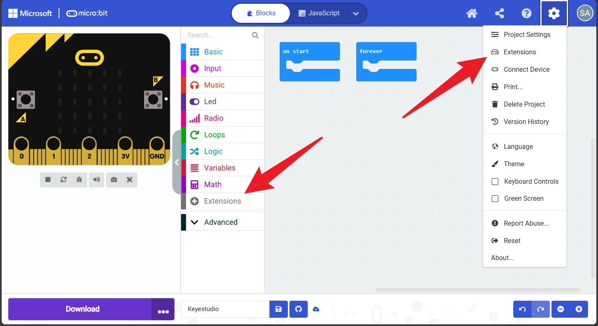

General Guide on Importing Micro:bit Extensions
===============================================

To use specific hardware components, you need to add the corresponding
extension library first.

**Step 1: Open Extensions** Click on **“Extensions”** at the bottom of
the toolbox (or click the Gear icon -> Extensions).

|image1|

**Method 1: Search by Name** Type the keyword (e.g., ``pca9685``) in the
search bar and press Enter. Click the extension card to add it.

|image2|

**Method 2: Import by URL (Recommended)**

1. Copy the extension URL provided for the hardware.

   ::

      Extensions_URL:https://github.com/keyestudio2019/pxt-pca9685-smallest

2. Paste the URL into the search bar on the Extensions page.

3. Click the extension card that appears to download it.

   |image3|

**Success:** Once loaded, a new category will appear in the toolbox on
the left. You can now drag and drop the blocks to program.

|image4|

Project
-------

.. toctree::
    :maxdepth: 1

    Project/Project13
    Project/Project14
    Project/Project15
    Project/Project16
    Project/Project17
    Project/Project18
    Project/Project19

.. |image2| image:: ./media/image-20251203165830809-1764752901458-7.png
.. |image3| image:: ./media/image-20251203165916274-1764752903357-9.png
.. |image4| image:: ./media/image-20251203170148951.png
