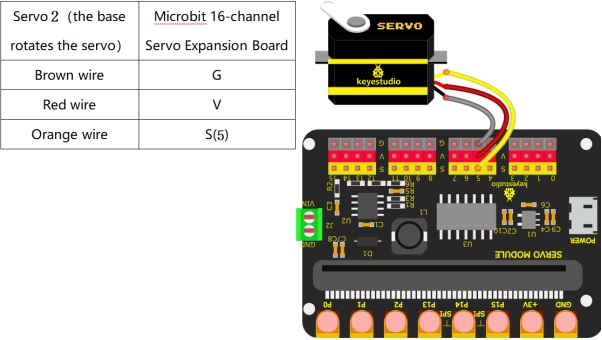

# Project 15 Button Controls Servo

------

## 1.Description

In the previous project, we learned how to control the servo automatically. In this project, we are going to use the **A/B buttons** on the Micro:bit mainboard to manually control the rotation of the servo. This mimics how we might control a robot arm using a remote controller.

- **Button A:** Controls rotation in one direction.
- **Button B:** Controls rotation in the opposite direction.

------

## 2.Wiring Diagram



------

## 3.Test Code

### 1.Preparations

1. Insert the Micro:bit into the robot arm's **16-channel servo shield**.
2. Connect the external power supply.
3. Connect the Micro:bit to your computer **via** a Micro USB cable.
4. Open the MakeCode editor (web or offline version).

Import Hex file, or drag the code manually (add the **pca9685** extension first).

------

### 2.drag the code manually

#### Add pca9685 Extension

**⚠️ Prerequisite: This project requires importing a specific extension to function. If you are new to this or unsure how to import extensions, please refer to our "General Guide on Importing Micro:bit Extensions" first. Once you are familiar with the process, please return to this tutorial.**

```
1Extensions_URL:https://github.com/keyestudio2019/pxt-pca9685-smallest
```

<div style="position:relative;height:0;padding-bottom:70%;overflow:hidden;"><iframe style="position:absolute;top:0;left:0;width:100%;height:100%;" src="https://makecode.microbit.org/#pub:S01196-10405-42470-64023" frameborder="0" sandbox="allow-popups allow-forms allow-scripts allow-same-origin"></iframe></div>

*(Note: The code block above is for display. Please ensure the logic matches: On Button A pressed -> Servo write 0; On Button B pressed -> Servo write 180, or specific angles as required.)*

### 3.Import Hex file

**To import the Hex file directly, please locate the downloaded Hex file and drag it into the editor.**

🏡[Click to download the code for this lesson](./Code/Button Controls Servo.hex)

After downloading the code, simply drag it directly into the coding area to upload it. (Note: The image below is for demonstration purposes only—please drag in the code you downloaded for this lesson above.)


------

## 4.Test Result

Download the code to the Micro:bit and power on using external power. Press the **reset** button on the Micro:bit board.

Then:

- Press **Button A** → **Servo 2** rotates to the **left** (e.g., 0°).
- Press **Button B** → **Servo 2** rotates to the **right** (e.g., 180°).
