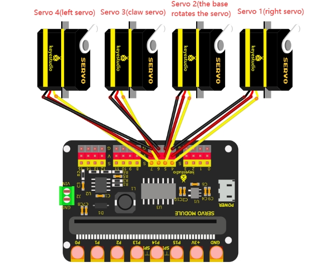

# Project 19 BT Controls Robot Arm


## 1.Description

In this project, we will combine the BT APP and the BT on Micro:bit to realize multiple functions of the robot arm.

------

## 2. Wiring Diagram

| Servo       | Function / Position | Shield Port                       | Brown Wire | Red Wire | Orange Wire |
| ----------- | ------------------- | --------------------------------- | ---------- | -------- | ----------- |
| **Servo 1** | Right               | Micro:bit 16-channel Servo Shield | G          | V        | S(4)        |
| **Servo 2** | Base Rotation       | Micro:bit 16-channel Servo Shield | G          | V        | S(5)        |
| **Servo 3** | Claw                | Micro:bit 16-channel Servo Shield | G          | V        | S(6)        |
| **Servo 4** | Left                | Micro:bit 16-channel Servo Shield | G          | V        | S(7)        |



## 3.Preparations

1. **Install the Micro:bit:** Insert the Micro:bit mainboard into the robot arm's 16-channel servo shield.
   - *Note: Ensure the Micro:bit's LED matrix is facing the correct direction (usually matching the silk screen markings on the shield).*
2. **Connect Power:** Connect the external power source (battery pack or DC adapter) to the shield, and **turn on** the power switch on the shield.
3. **Connect to PC:** Connect the Micro:bit to your computer using a **Micro USB data cable**.
   - *Check: You should see a drive named "MICROBIT" appear on your computer.*
4. **Launch Software:** Open the MakeCode editor.
   - **Web Version:** Visit https://makecode.microbit.org/
   - **Offline Version:** Launch the MakeCode Offline App if installed.

drag the code manually (add the **pca9685** extension library first).

### Add the pca9685 Extension Library

1. Open **Settings → Extensions**.

2. Input the link:

    ```
    https://github.com/keyestudio2019/pxt-pca9685-smallest
    ```

    

3. Search, download, and install the extension.

4. After installation, you'll find the **pca9685** extension library on the left.

------

## 4.Test Code

<div style="position:relative;height:0;padding-bottom:70%;overflow:hidden;"><iframe style="position:absolute;top:0;left:0;width:100%;height:100%;" src="https://makecode.microbit.org/#pub:S79565-28171-91749-44244" frameborder="0" sandbox="allow-popups allow-forms allow-scripts allow-same-origin"></iframe></div>

------

**To import the Hex file directly, please locate the downloaded Hex file and drag it into the editor.**

🏡[Click to download the code 1 for this lesson](./Code/BT Controls Robot Arm.hex)

After downloading the code, simply drag it directly into the coding area to upload it. (Note: The image below is for demonstration purposes only—please drag in the code you downloaded for this lesson above.)


## 5.Test Result

### (1) Project Settings

Tap **Settings → Project Settings**, enter **“BT Controls Robot Arm”**, and set **“No Pairing Required”** to **ON**.
 *(Not required if importing the provided code directly.)*


### (2) Download & Connect

1. Download code to the Micro:bit mainboard and connect external power.
2. Open the **“keyes arm”** APP and connect via Bluetooth (refer to Project 18: Read BT Data).
3. Use the APP buttons to control the robot arm.

## 7.Functions of Buttons

|                    |  Connect the APP to the Bluetooth of the microbit mainboard  |                                                              |
| :----------------------------------------: | :----------------------------------------------------------: | ------------------------------------------------------------ |
|                    |                   Disconnect the Bluetooth                   |                                                              |
|    | Press:“F”--->The big pendulum connected to servo 4 swings forward | Release:“S”---->The big pendulum connected to servo 4 doesn’t move |
|    |            Press:“L”--->The robot claw will open             | Release:“S”--->The robot claw will not move                  |
|   |                           Mode: 1                            |                                                              |
|   |            Press:“R”--->The robot claw will close            | Release:“S”--->The robot claw will not move                  |
|   | Press:“B”--->The big pendulum connected to servo 4 swings backward | Release:“S”--->The big pendulum connected to servo 4 doesn’t move |
|   | Press:“f”--->The small pendulum connected to servo 1 swings backward | Release:“S”--->The small pendulum connected to servo1 will not move |
|   |               Press:“l”--->Servo 2 turns left                | Release:“S”--->Servo 2 will not rotate                       |
|  |                           Mode: 2                            |                                                              |
|  |               Press:“r”--->Servo 2 turns right               | Release:“S”--->Servo 2 will not rotate                       |
|                   | Press: “b”--->The small pendulum connected to servo 1 swings forward | Release:“S”--->The small pendulum connected to servo 1 will not move |

