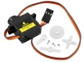
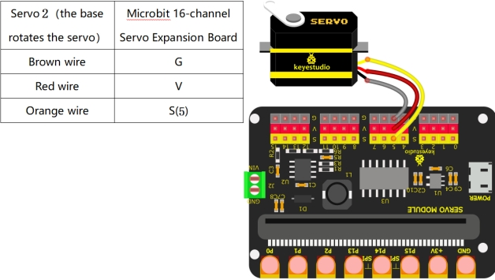

# Project 14：Rotation of Servo

------

## 1.Description

In the previous project, we set the servo angle. But **what exactly is a servo?** A servo is a motor designed for **precise movement**. It is widely used in toy cars, remote-controlled helicopters, aircraft, robots, and other fields. In this project, we are going to learn **how to control** the rotation of the servo.

------

## 2.Component Introduction



### Servo

**Servo Overview** A servo is a rotary actuator designed for precise **position control**. It mainly consists of a housing, a circuit board, a motor (often coreless), a gear set, and a position detector (potentiometer).

**Working Principle:** The servo receives a control signal from an MCU or receiver. It generates an internal reference signal (typically with a period of **20 ms** and a width of **1.5 ms**) and compares this with the voltage from the potentiometer to obtain a voltage difference (error signal).

The IC on the circuit board **determines** the rotation direction based on this difference and drives the motor. The reduction gears transfer power to the output shaft (swing arm) while simultaneously driving the position detector to provide **feedback**.

**Conclusion:** As the motor rotates, the reduction gears drive the potentiometer until the voltage difference becomes zero, at which point the motor stops. This mechanism makes servos ideal for control systems requiring precise angle adjustments and **position holding**.


- **Rotation Range:** 0° ~ 180°
- **Pulse Period:** 20 ms
- **Pulse Width Range:** 0.5 ms ~ 2.5 ms
- **Angle Mapping:** -90° ~ +90°

**Servo wire colors:**


- Brown → GND
- Red → Power +
- Orange → Signal

------

## 3.Wiring Diagram



------

## 4.Test Code

### 1.Preparations

1. Insert the Micro:bit into the robot arm's **16-channel servo shield**.
2. Connect the external power supply.
3. Connect the Micro:bit to your computer **via** a Micro USB cable.
4. Open the MakeCode editor (web or offline version).

Import Hex file, or drag the code manually (add the **pca9685** extension library first, refer to *1. Development Environment Configuration*).

------

### 2.drag the code manually

#### Add pca9685 Extension

**⚠️ Prerequisite: This project requires importing a specific extension to function. If you are new to this or unsure how to import extensions, please refer to our "General Guide on Importing Micro:bit Extensions" first. Once you are familiar with the process, please return to this tutorial.**

```
Extensions_URL:https://github.com/keyestudio2019/pxt-pca9685-smallest
```

<div style="position:relative;height:0;padding-bottom:70%;overflow:hidden;"><iframe style="position:absolute;top:0;left:0;width:100%;height:100%;" src="https://makecode.microbit.org/#pub:S83109-87621-73472-62739" frameborder="0" sandbox="allow-popups allow-forms allow-scripts allow-same-origin"></iframe></div>

### 3.Import Hex file

**To import the Hex file directly, please locate the downloaded Hex file and drag it into the editor.**

🏡[Click to download the code 1 for this lesson](./Code/Rotation of Servo.hex)

After downloading the code, simply drag it directly into the coding area to upload it. (Note: The image below is for demonstration purposes only—please drag in the code you downloaded for this lesson above.)


------

## Test Result

Download the code to the Micro:bit and power on using external power.
 Press the reset button on the Micro:bit board.
 Then **Servo 2** (the base rotation servo) will rotate **from right to left**, and then **from left to right**.

