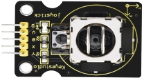

# Project 16：Read the Joystick

------

## 1.Description

The **Joystick module** is a component equipped with two analog inputs and one digital input. It is widely used in game controllers, robot control, and drone navigation.

The **X and Y pins** of the module are **analog inputs**, allowing you to directly read the measured analog values to determine direction and magnitude. The **Z axis (B pin)** acts as a **digital button**. To use it, you must first set its pin to the **input state**, and then read the value: **1 (pressed)** or **0 (not pressed)**. In this project, we will read these values and print them to the serial monitor.

------

## 2.Component Introduction

### Joystick

The module primarily uses a **PS2 joystick component**. It contains three signal terminal pins that simulate a **3D space**:

- **GND**
- **VCC**
- **Signal terminals: B, X, Y**

**X / Y (Analog):**

- **X**: Simulates movement along the X-axis.
- **Y**: Simulates movement along the Y-axis.
- When pushed in an arrow direction, the voltage value increases or decreases depending on the axis direction.

**B (Digital):**

- Connected to a digital port.
- **Default output:** 0
- **Pressed output:** 1

**Specifications:**

- **Input Voltage:** 3.3V ~ 5V
- **Output Signal:** X/Y (Analog) + Z (Digital)
- **Applications:** Plane coordinate control, servo control.
- **Features:** Good tactile feedback, sensitive, and durable.

------

## 3.Wiring Diagram

------

## 4.Test Code

### 1.Preparations

1. Insert the Micro:bit mainboard into the robot arm's **16-channel servo shield**.
2. Connect the external power supply.
3. Connect the Micro:bit to your computer **via** a Micro USB cable.
4. Open the MakeCode editor (web or offline version).

------

### 2.drag the code manually

*(Note: This project uses standard input/output blocks and does not strictly require the specific extension used in previous servo projects, but ensure your board settings are correct.)*

<iframe style="position:absolute;top:0;left:0;width:100%;height:100%;" src="https://makecode.microbit.org/#pub:S01313-55289-45891-03222" frameborder="0" sandbox="allow-popups allow-forms allow-scripts allow-same-origin"></iframe>

### 3.Import Hex file

**To import the Hex file directly, please locate the downloaded Hex file and drag it into the editor.**

🏡[Click to download the code for this lesson](./Code/Read the Value of Joystick.hex)

After downloading the code, simply drag it directly into the coding area to upload it. (Note: The image below is for demonstration purposes only—please drag in the code you downloaded for this lesson above.)

------

## 5.Test Result

Open CoolTerm. As shown in the picture, select the Micro:bit's COM port and set the Baud Rate to 115200. (Note: Please select the actual COM port number on your computer; it may not necessarily be COM6 as shown in the example image.)

The serial monitor will display the values in real-time:

- Left joystick X analog value

- Left joystick Y analog value

- Right joystick Y analog value

- Right joystick B digital value

  

**Shake the joystick** or **press the B button**, and observe the values changing on the screen.