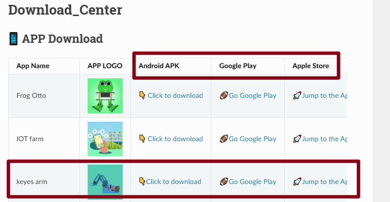
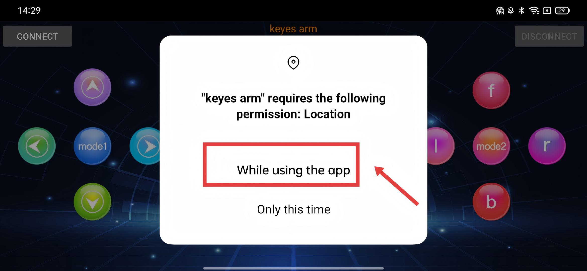
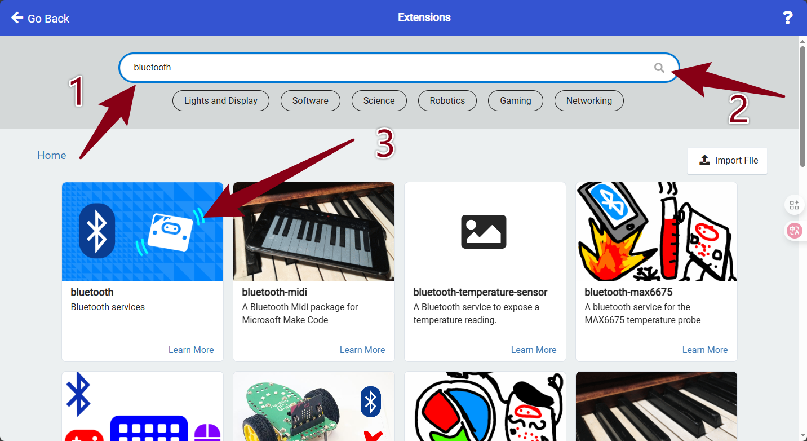
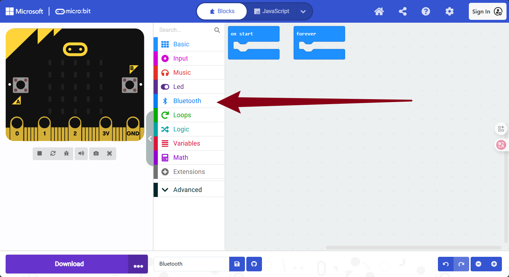
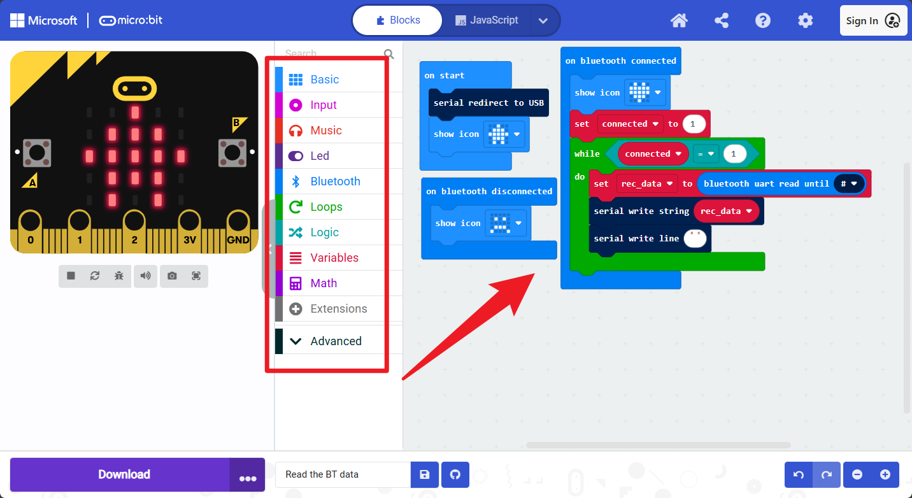
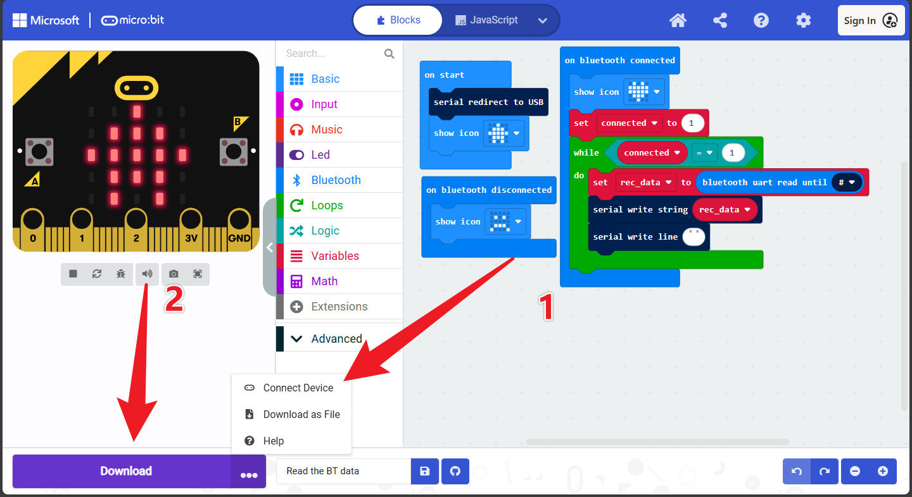
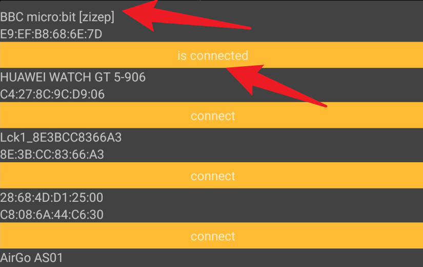
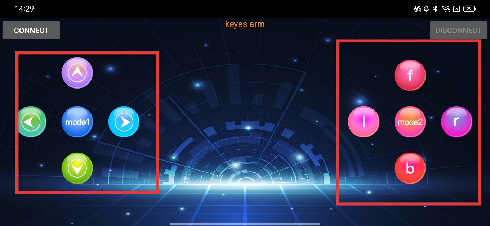

# Project 18: Read BT Data


------

## 1.Description

The micro:bit control board is equipped with built-in Bluetooth Low Energy (BLE) functionality, enabling seamless wireless communication and control with a wide range of devices—including smartphones, tablets, and computers. It offers full compatibility with both Android and iOS platforms.
By using a dedicated Bluetooth-enabled mobile application (BT APP), users can wirelessly interact with the micro:bit and control external peripherals connected to it—such as LEDs, motors, sensors, and more.
In this project, you will:
Explore the user interface of the BT APP,
Learn the function of each on-screen button,
Understand how to interpret and process the character data transmitted from the app to the micro:bit via Bluetooth.
This foundational knowledge will empower you to design interactive projects that bridge mobile devices and physical computing through wireless communication.

------

## 2.APP Installation

###### **1.APP Buttons for Controlling the Robot Arm**


The APP contains **10 control buttons**.
When the BT module on the Micro:bit is connected, pressing a button sends its **corresponding value** via Bluetooth.
We can read and test the values through the serial monitor.

###### **2. Download and Install the Official App**

Please follow the steps below to install the "keyes arm" application on your device:


**For Android Users (Google Play)**

1. Open the **Google Play Store** on your phone.
2. Enter "**keyes arm**" in the search bar.
3. Find the official app published by **keyestudio** and tap "**Install**".

**For iOS Users (App Store)**

1. Open the **App Store** on your iPhone or iPad.
2. Search for "**keyes arm**".
3. Tap "**Get**" or the cloud download icon to install the app.

**Alternative Download Method**

You can also download the application via the official Keyestudio Download Center: 

1. Open input the link:

    ```
    https://docs.keyestudio.com/en/latest/docs/Download_Center/Download_Center.html
    ```

2. Select *‘keyes arm’* and install.

    

    **⚠️ Important: App Permissions**

    For the **Bluetooth connection** to function correctly, the APP must have **Location Permission** enabled on your smartphone or tablet.

    - Please allow this permission when prompted upon first opening the app.

    - Without this permission, the app may fail to search for or connect to the device.

      

      

    ------

    **Note:** Do not download APK files from third-party websites. To ensure security and compatibility, please always install the official app via Google Play, the App Store, or the official Keyestudio website.

## 3.Load Code and Add Bluetooth Extension

<iframe width="799" height="449" src="https://www.youtube.com/embed/7JNEF01WR4w" title="Name badge coding" frameborder="0" allow="accelerometer; autoplay; clipboard-write; encrypted-media; gyroscope; picture-in-picture; web-share" referrerpolicy="strict-origin-when-cross-origin" allowfullscreen></iframe>

**Step 1: Open MakeCode** Open the offline software or visit the Web version of MakeCode at: **https://makecode.microbit.org/**

**Step 2: Import Code** You can either **Import the Hex file** directly into the editor or drag/write the code manually. *(Note: If you are coding manually from scratch, you must add the Bluetooth extension library first.)*

** Add the Bluetooth Extension**

1. Click on **Extensions** .

   

2. In the search bar on the library page, type "**bluetooth**" and search.

3. Click on the "**bluetooth**" extension card to add it.

   

   

**⚠️ Important: Bluetooth & Radio Compatibility**

Due to hardware limitations of the Micro:bit, **Bluetooth and Radio functions cannot work simultaneously**. Therefore, their extension libraries are incompatible with each other.

- When installing the "**bluetooth**" extension library, if you receive a compatibility warning, please click "**Remove extension(s) and add bluetooth**" to confirm the change.

  

  *Note: If the "Bluetooth" category is already visible in the block list on the left, you do not need to search for or add it again.*

  

## 4.Text code

Manually drag the code block out from the sidebar as shown below.



**To import the Hex file directly, please locate the downloaded Hex file and drag it into the editor.**

🏡[Click to download the code 1 for this lesson](./Code/Read the BT Data.hex)


## 5.Flash the code

Click **Download** to flash the code to your Micro:bit.(Remember to connect the Micro:bit board to the computer before uploading the code.)



## 6.Data Reading

Open CoolTerm. As shown in the picture, select the Micro:bit's COM port and set the Baud Rate to 115200. (Note: Please select the actual COM port number on your computer; it may not necessarily be COM6 as shown in the example image.)


Open the previously downloaded App and connect to the Micro:bit board.


Click '**Connect**'. If the status displays '**is Connected**', it indicates that the connection is successful.



Press the buttons on the App, and you will see CoolTerm display the characters corresponding to each button.




## 7.Functions of Buttons

|   | Connect the APP to the Bluetooth of the microbit mainboard |             |
| :---------------------------------------: | :--------------------------------------------------------: | ----------- |
|  |                  Disconnect the Bluetooth                  |             |
|                   |                         Press:“F”                          | Release:“S” |
|                   |                         Press:“L”                          | Release:“S” |
|                   |                          Mode: 1                           |             |
|                   |                         Press:“R”                          | Release:“S” |
|                   |                         Press:“B”                          | Release:“S” |
|                   |                         Press:“f”                          | Release:“S” |
|                   |                         Press:“l”                          | Release:“S” |
|                  |                          Mode: 2                           |             |
|                  |                         Press:“r”                          | Release:“S” |
|                  |                         Press: “b”                         | Release:“S” |

## FAQ

1.If the App fails to connect to the Micro:bit board, please restart the App and try connecting again.

